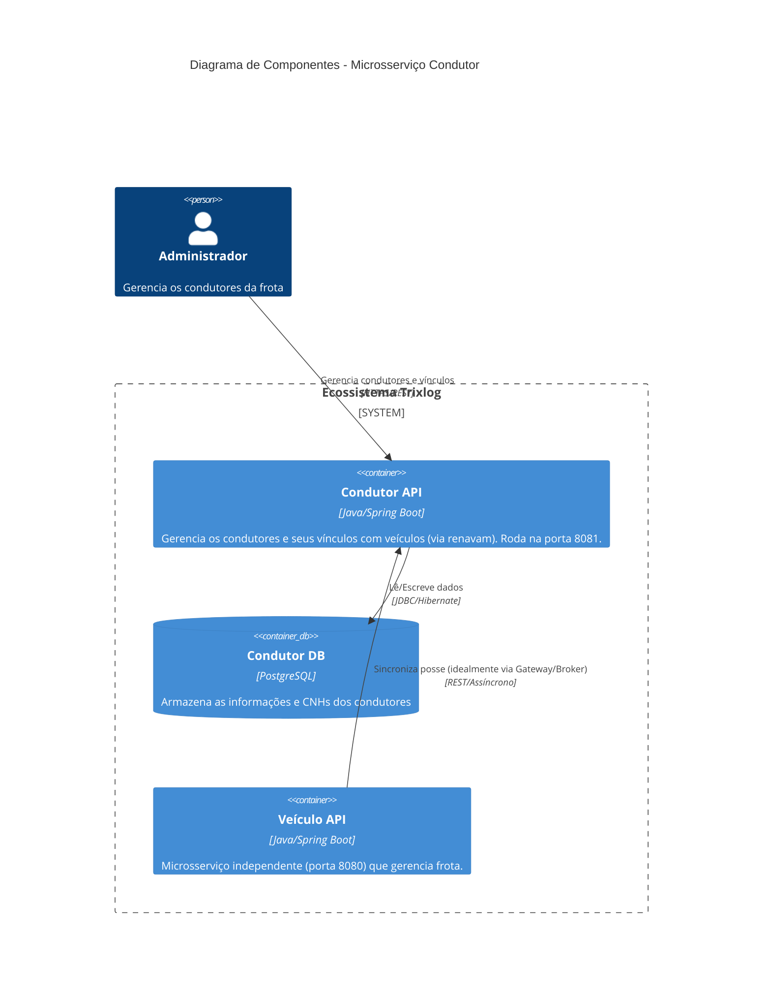

# Arquitetura do Microsserviço

## Diagrama C4 (Container)

## Separação de Camadas
- **Controller**: Expõe os endpoints e realiza *Bean Validation*. Converte retornos para *ResponseEntity* e intercepta exceções com `@RestControllerAdvice`.
- **Service**: Concentra regras de negócio puras, utilizando limites transacionais (`@Transactional`) para gerenciar as mutações no banco de forma otimizada.
- **Repository**: Camada Spring Data JPA com uso agressivo de `@EntityGraph` para resolver gargalos N+1 nas coleções LAZY.
- **DTO**: Padrão *Record* nativo do Java garantindo isolamento da infraestrutura de Banco de Dados da camada web.
