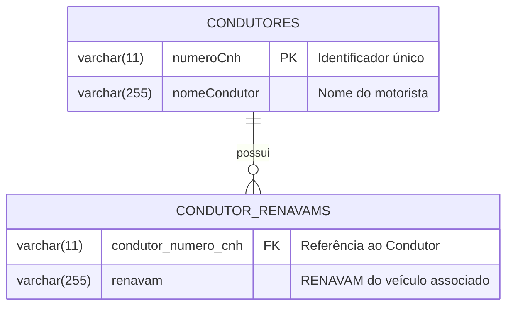

# Banco de Dados

## Diagrama Entidade-Relacionamento

## Dicionário de Dados
A tabela `condutores` armazena as raízes (aggregates). A lista de posse de veículos (`renavams`) foi desenhada usando a arquitetura de coleções nativas do Hibernate (`@ElementCollection`), gerando implicitamente a tabela `condutor_renavams`. Esse formato viabiliza que o Condutor saiba seus renavams sem carregar chaves pesadas da tabela de Veículos (desacoplamento físico).
