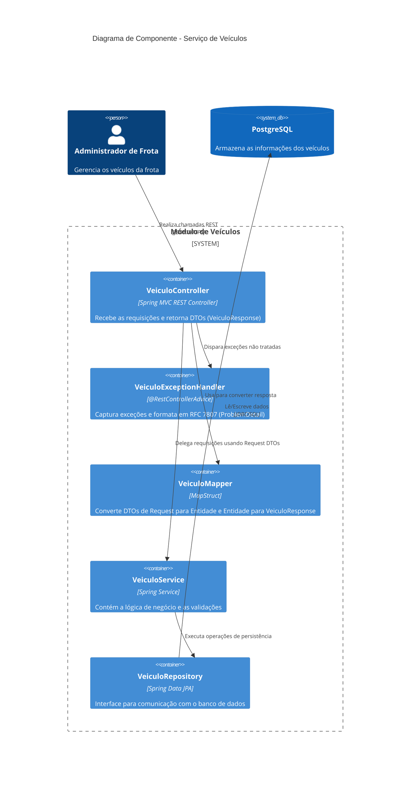

# Arquitetura do Serviço de Veículos

Este documento descreve a arquitetura do módulo de gerenciamento de veículos.

## Diagrama de Componentes (C4 Model)

## Fluxo de Dados

1. O cliente HTTP envia um payload JSON para o `VeiculoController`.
2. O `VeiculoController` utiliza Bean Validation (`@Valid` em `NovoVeiculo` DTO). Falhas de validação caem no `VeiculoExceptionHandler` (retornando HTTP 400).
3. O controller envia o DTO para o `VeiculoService`.
4. O `VeiculoService` aplica as regras de negócio pesadas. Se falhar, lança um `IllegalArgumentException` que também é traduzido pelo `VeiculoExceptionHandler`.
5. Com a aprovação do Service, o `VeiculoRepository` salva no `PostgreSQL`.
6. Na volta (GETs ou retornos de busca), o `VeiculoController` passa a Entidade JPA pelo `VeiculoMapper`, devolvendo ao cliente um `VeiculoResponse` (DTO enxuto).
