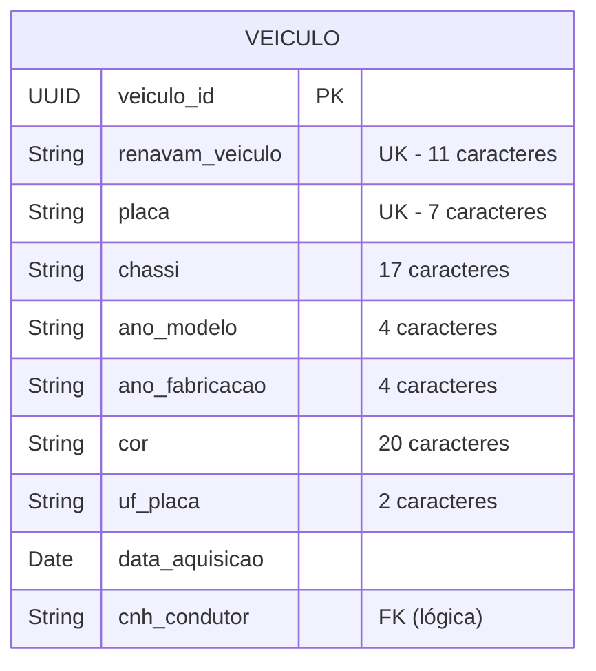

# Modelagem do Banco de Dados

O serviço de veículos utiliza o banco de dados PostgreSQL.

## Diagrama Entidade-Relacionamento

## Dicionário de Dados

A tabela principal do módulo é a `veiculo`. Abaixo está a definição de algumas colunas cruciais:

- **veiculo_id**: Chave primária utilizando UUID para maior segurança e distribuição.
- **renavam_veiculo**: O Renavam deve ser único e conter 11 dígitos numéricos, validado pela aplicação.
- **placa**: Única, validada conforme padrões brasileiros (Mercosul ou antigo).
- **cnh_condutor**: Armazena a referência para o condutor caso o veículo esteja alocado a alguém. Se `null`, significa que o veículo está livre na frota.
